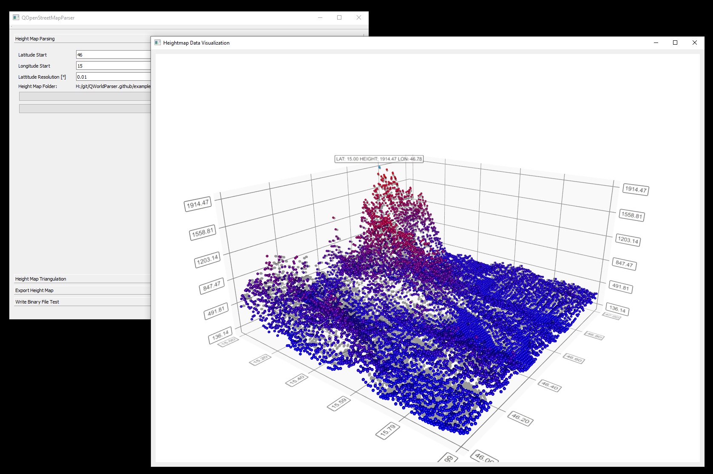

# QWorldParser

A parser for SRTM data (unfinished, but it works, if you can get it to compile). It also includes a Delaunay triangularization implementation.



## Description

The program can take SRTM data in hgt format and convert it to a height map. There are a few scripts to plot it using GnuPlot provided. Also some examples for inputs/outputs and finished plots can be found in the examples/ directory.

Sadly enough, I never finished this project, but maybe it helps someone.

Also I was not able to upload the git history to GitHub due to file size restrictions, but who cares ;)

## Requirements

- CMake
- Qt5 >= 5.12
- mingw or g++ with C++11 support

## Build

### Windows

```
md build
cd build
cmake .. -G "MinGW Makefiles"
mingw32-make
mingw32-make test
```

### Linux

```bash
mkdir build
cd build
cmake ..
make
make test
```
